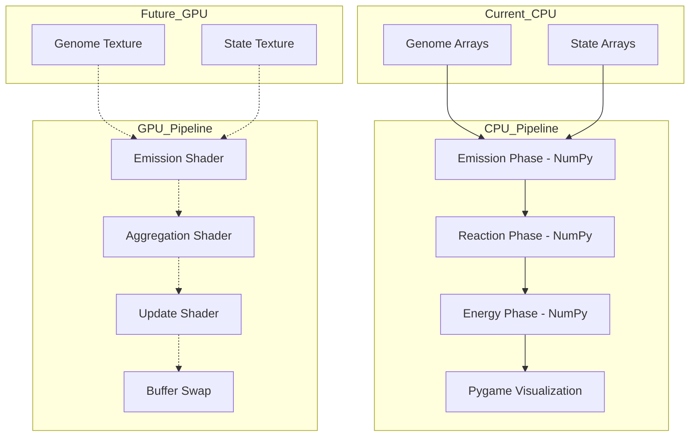
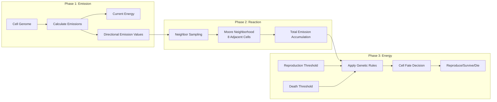
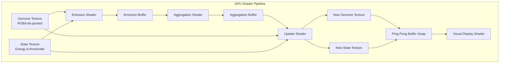

# Genetic Cellular Automaton

*A Conway's Game of Life implementation with evolutionary genetics and GPU-accelerated computation*

## Overview

This project reimagines Conway's Game of Life as a **genetic cellular automaton** where each cell carries encoded DNA that determines its behavior through directional emissions, reproduction thresholds, and death tolerances. Unlike traditional Conway's GoL with binary alive/dead states, this implementation features cells with genetic codes that create emergent evolutionary patterns and complex ecosystem dynamics.

The system demonstrates how simple genetic rules can lead to sophisticated behaviors including territorial expansion, migratory patterns, and symbiotic relationships between different cellular species.

## Current Implementation Status

**CPU Prototype** *Working Demo*

- [X] Genetic encoding system with 4-directional emissions
- [X] NumPy-based simulation engine with energy conservation
- [X] Pygame visualization with real-time genetic diversity display
- [X] Random scenario generation with diverse species archetypes
- [X] Interactive controls for exploration and experimentation

**Status**: Fully functional CPU-based prototype demonstrating genetic cellular automaton concepts and evolutionary dynamics.

**Planned GPU Shader Migration** *Future Implementation*

- [ ] GLSL shader translation of CPU simulation logic
- [ ] Bit-packed texture encoding for genetic information
- [ ] 3-phase GPU pipeline (Emission → Aggregation → Update)
- [ ] Fragment shader logic with ping-pong buffer rendering
- [ ] OpenGL texture management for large-scale simulations

**Goal**: Migrate proven CPU algorithms to pure GPU shaders for massive performance scaling (2048x2048+ grids at 60+ FPS).

## Architecture Principles

- **Genetic Determinism**: Each cell's behavior encoded in 4-directional emission values, reproduction threshold, and death threshold
- **GPU-First Design**: Bit-packed data structures optimized for shader computation
- **Shader Compatibility**: Branchless logic for efficient fragment shader execution
- **Local Interactions**: All cellular decisions based on Moore neighborhood (8-cell) emission accumulation
- **Energy Conservation**: Global energy input balanced by emission costs and cellular metabolism
- **Emergent Complexity**: Simple genetic rules producing three dominant evolutionary strategies
- **Spatial Dynamics**: Directional emissions enable territorial control, migration, and spatial competition

## Current Evolutionary Findings

After extensive experimentation, the system consistently converges to **three dominant evolutionary strategies**:

### 1. **Low-Cost Expansionists**

- **Strategy**: Minimal emissions, very low reproduction threshold
- **Behavior**: Exploit natural energy input to achieve maximum spatial coverage
- **Advantage**: Extremely efficient resource utilization
- **Pattern**: Carpet-like expansion covering most available space

### 2. **High-Cost Migrators**

- **Strategy**: High directional emissions, low reproduction threshold
- **Behavior**: Form traveling waves that exploit energy between migration cycles
- **Advantage**: Rapid territorial conquest and resource extraction
- **Pattern**: Pulsating wave fronts with periodic expansion-contraction cycles

### 3. **Symbiotic Ecosystems** *(Most Interesting)*

- **Ultra-Low-Cost Decomposers**: Cannot reproduce independently, require external emissions
- **High-Cost Producers**: Generate emissions that enable decomposer reproduction, take the energy produced in the space that decomposers are not residing
- **Dynamics**:
  - **Predatory**: Decomposers block high-cost expansion paths
  - **Symbiotic**: Decomposers form protective barriers enabling mutual coexistence
- **Emergent Behavior**: Complex spatial patterns resembling biological ecosystems

### Convergence Problem

**Critical Limitation**: These strategies are **mutually exclusive** at current simulation scales. Each scenario inevitably converges to one dominant strategy, preventing long-term coexistence and reducing ecosystem diversity.

## Technology Stack

**Current CPU Implementation:**

- **Core Framework**: Python 3.8+ with NumPy for simulation logic
- **Visualization**: Pygame for real-time display and interaction
- **Data Structures**: Python classes with genetic encoding
- **Performance**: CPU-based computation suitable for prototype grids (100x100)

**Planned GPU Migration:**

- **GPU Computing**: OpenGL 4.3+ with ModernGL for Python bindings
- **Shader Language**: GLSL fragment shaders for cellular computation
- **Data Structures**: Bit-packed RGBA textures for genetic encoding
- **Performance**: Massively parallel GPU computation targeting 2048x2048+ grids

## Project Structure

**Current CPU Implementation:**

```
Boris/
├── genetic_automaton.py            # Main Pygame application (current demo)
├── requirements.txt                # Python dependencies (NumPy, Pygame)
├── models/                         # Genetic data structures
│   ├── cell_genome.py              # 4-directional emission encoding and behaviours
│   └── cell_state.py               # Cell state management (energy, emission accumulations)
├── simulation/                     # CPU simulation engine
│   └── new_cpu_simulator.py        # NumPy-based genetic cellular automaton
└── README.md                       # This file
```

**Planned GPU Structure:**

```
Boris/
├── genetic_automaton.py            # OpenGL application entry point
├── shaders/                        # GLSL shader programs (future)
│   ├── emission_phase.frag         # Phase 1: Cellular emission computation
│   ├── aggregation_phase.frag      # Phase 2: Neighbor influence aggregation
│   ├── update_phase.frag           # Phase 3: State transition & reproduction
│   ├── vertex_shader.vert          # Standard quad vertex shader
│   └── display_shader.frag         # Genetic visualization renderer
├── gpu/                            # GPU management (future)
│   ├── texture_manager.py          # Texture creation and ping-pong buffers
│   ├── shader_loader.py            # GLSL compilation and program linking
│   └── gpu_simulator.py            # OpenGL context and render loop
└── ...                             # Additional GPU modules
```

## Core Components & Simulation Flow

**Current CPU Implementation:**

1. **Genetic Encoding** - 4-directional emission values stored in Python objects
2. **NumPy Simulation** - 3-phase computation cycle on CPU arrays
3. **Pygame Visualization** - Real-time display with genetic diversity colors
4. **Energy Conservation** - Global energy balance with emission costs
5. **Random Scenarios** - Diverse species generation with spatial clustering

**3-Phase CPU Simulation Cycle:**

1. **Emission Phase**: Each cell calculates directional emissions based on genome and energy
2. **Reaction Phase**: Cells accumulate emissions from Moore neighborhood (8 neighbors)
3. **Energy Phase**: Apply genetic rules for reproduction, death, and energy updates

**Planned GPU Migration:**

The CPU logic will be translated to GPU shaders where each phase becomes a fragment shader operating on texture data with massively parallel processing.



## Data Architecture

### Current CPU Implementation

The simulation operates on NumPy arrays with Python genetic objects:

#### **Genetic Encoding** (Python Objects)

Each cell contains genetic information defining its behavior:

- **Emissions Array**: 4 directional values (North, East, South, West) ranging 0-15
- **Reproduction Threshold**: Emission level required for reproduction (0-15), later multiplied by 16
- **Death Threshold**: Emission level in wich the cell dies (0-15), later multiplied by 16
- **Current Energy**: Dynamic energy state affecting emission strength
- **Emission Accumulation**: Total emission received (minus dissipated)

### Planned GPU Migration

Future shader implementation will use bit-packed textures:

#### **Genome Texture** (RGBA)

- **R Channel**: North(4bit) + East(4bit) emission values
- **G Channel**: South(4bit) + West(4bit) emission values
- **B Channel**: Death threshold(4bit) + Reproduction threshold(4bit)
- **A Channel**: Available for future behaviours

#### **State Texture** (RGBA)

- **R Channel**: Energy(8bit)
- **G Channel**: Emission accumulation(8bit)
- **B Channel**: Available
- **A Channel**: Available

## Simulation Algorithm

### Current CPU Implementation (NumPy-based)

The working prototype implements a 3-phase computation cycle:



**Phase Details:**

- **Emission**: Each cell calculates directional emissions based on genome and current energy
- **Reaction**: Cells accumulate emissions from all 8 neighboring cells (Moore neighborhood)
- **Energy**: Genetic thresholds determine reproduction, survival, or death based on accumulated emissions and energy levels

### Planned GPU Shader Migration

The CPU logic will be translated to GPU fragment shaders with massive parallelization:



**Key GPU Advantages:**

- **Parallel Processing**: All cells computed simultaneously instead of sequentially
- **Bit-Packed Textures**: Efficient 4-bit genetic encoding in RGBA channels
- **Fragment Shaders**: Direct translation of CPU logic to GPU-native operations
- **Ping-Pong Rendering**: Double-buffered textures for temporal consistency
- **Massive Scaling**: Support for millions of cells with real-time performance

## Design Decisions

### Genetic Encoding Strategy

**4-bit directional emissions** rather than single values:

- Enables complex spatial behaviors (territoriality, cooperation, migration)
- Maps efficiently to GPU texture channels
- Allows for asymmetric emission patterns creating directed movement
- Provides sufficient genetic diversity without excessive complexity

### Energy Conservation Model

**Local energy conservation** with optional global constraints:

- Prevents runaway population growth
- Creates natural selection pressure for efficient genomes
- Enables boom-bust population cycles
- Supports stable ecosystem equilibria

### Deterministic Mutations

**Bit-flip mutations based on deterministic noise** rather than random:

- Maintains reproducibility across runs
- Enables debugging and analysis of specific genetic lineages
- Compatible with shader execution model
- Allows for controlled mutation pressure adjustment

### Conway's Game of Life Preservation


| Original Conway's Rule      | Genetic Equivalent                            |
| ----------------------------- | ----------------------------------------------- |
| 3 neighbors → birth        | Sufficient emission threshold → reproduction |
| <2 or >3 neighbors → death | Energy below/above viable range → death      |
| Static structures           | Self-stabilizing genetic configurations       |
| Gliders & oscillators       | Asymmetric emission patterns → movement      |

## Development Roadmap

### Phase 1: CPU Prototype *Complete*

- [X] Python-based genetic cellular automaton with NumPy
- [X] 4-directional emission system with genetic encoding
- [X] 3-phase simulation cycle (emission → reaction → energy)
- [X] Pygame visualization with real-time genetic diversity
- [X] Random scenario generation and interactive controls

### Phase 2: GPU Migration

- [ ] GLSL shader implementation of all simulation phases
- [ ] OpenGL texture management and ping-pong rendering
- [ ] Performance optimization for large grids (1024x1024+)
- [ ] Real-time genetic analysis and visualization

### Phase 3: Advanced Features

- [ ] Interactive genetic editing tools
- [ ] Population diversity metrics and tracking
- [ ] Export/import of stable genetic configurations
- [ ] Comparative analysis with traditional cellular automata

### Phase 4: Ecosystem Analysis

- [ ] Long-term evolution tracking
- [ ] Emergent behavior classification
- [ ] Genetic lineage analysis
- [ ] Ecosystem stability studies

## Expected Evolutionary Behaviors

- **Territorial Species**: High-emission genomes creating spatial dominance zones
- **Symbiotic Colonies**: Complementary emission patterns enabling mutual survival
- **Migratory Waves**: Asymmetric emissions producing traveling population fronts
- **Predator-Prey Dynamics**: Competing genetic strategies in dynamic equilibrium
- **Reproductive Cycles**: Periodic population booms and genetic bottlenecks
- **Genetic Drift**: Gradual evolution toward locally optimal configurations

## Performance Targets

### Current CPU Implementation

- **Grid Size**: 100x100 cells at 10+ FPS (Pygame visualization)
- **Genetic Complexity**: 4-direction emissions + reproduction/death thresholds
- **Memory Usage**: Minimal - Python objects in memory
- **Visualization**: Real-time genetic diversity display with interactive controls

### Planned GPU Implementation

- **Grid Size**: 2048x2048 cells at 60+ FPS
- **Shader Efficiency**: <1ms per simulation phase
- **Memory Usage**: <100MB for all textures and buffers

## Getting Started

### Current CPU Demo

**Prerequisites:**

- **Python 3.8+**
- **NumPy** for simulation arrays
- **Pygame** for visualization and interaction

**Quick Start:**

```bash
# Clone and navigate to implementation
cd Conway-Game-of-Life/Boris

# Install dependencies  
pip install -r requirements.txt

# Run the working CPU prototype
python genetic_automaton.py
```

**Controls:**

- **N key**: Generate new random scenario
- **R key:** Reset current scenario
- **Space:** Pause
- **S key:** Makes the simulation advance 1 step
- **Up / Down:** Make the cells bigger / smaller (visually)
- **Right / Left:** Make the simulation go faster / slower
- **Watch**: Evolution of the three dominant strategies

### Future GPU Implementation

**Additional Prerequisites for GPU version:**

- **OpenGL 4.3+** compatible graphics card
- **ModernGL** for OpenGL bindings and shader management
- **4GB+ VRAM** recommended for large simulations

**Planned Usage:**

```bash
# Future GPU version (not yet implemented)
python genetic_automaton.py --gpu --grid-size 2048
```

### Configuration Examples

**Current CPU Implementation:**

The system supports different genetic archetypes for diverse evolutionary strategies:

- **Low-Cost Expansionists**: Minimal emissions with very low reproduction threshold
- **High-Cost Migrators**: Asymmetric emissions creating directional movement patterns
- **Symbiotic Species**: Ultra-low emissions requiring external support for reproduction
- **Balanced Strategies**: Medium emissions with moderate thresholds for stable populations

**Planned GPU Implementation:**

Future shader version will encode the same genetic strategies in bit-packed RGBA textures, with 4-bit precision for each genetic parameter enabling 16^8 (when all the behaviours are implemented) possible genetic combinations per cell.

## Future Integration

This genetic cellular automaton provides a proven foundation for GPU shader migration:

**Current CPU Demo Benefits:**

1. **Algorithm Validation**: Proven genetic rules producing emergent behaviors
2. **Visual Debugging**: Real-time observation of evolutionary strategies
3. **Parameter Tuning**: Optimal values for reproduction, death, and energy systems
4. **Genetic Discovery**: Three dominant strategies identified and documented

**Planned GPU Migration Advantages:**

1. **Massive Scale**: Multi-million cell grids running in real-time
2. **Complex Genetics**: Unlimited genetic complexity through additional textures
3. **3D Extension**: Volumetric grids with 26-neighbor interactions
4. **ML Integration**: GPU tensor operations for genetic pattern recognition
5. **Real-Time Editing**: Interactive genetic manipulation at massive scales

## Development Notes

**August 04, 2025 - Project Initialization**
Starting with the genetic cellular automaton concept as an advanced-level Conway's Game of Life implementation. The focus is on creating a deterministic system that can evolve complex behaviors while maintaining the aesthetic appeal of classical cellular automata.
Key design challenge: balancing genetic complexity with computational efficiency. The 4-bit emission encoding provides 16^8 possible genetic configurations per cell, which should be sufficient for interesting evolution while remaining shader-friendly.Future Considerations:

- Investigate genetic algorithm techniques for optimizing stable configurations
- Explore connections to artificial life and digital evolution research
- Consider integration with machine learning for pattern recognition and classification

**August 05, 2025 - Current Status**

The genetic cellular automaton has successfully demonstrated emergent evolutionary strategies, but revealed a critical limitation: **strategy convergence**. The three dominant strategies (low-cost expansion, high-cost migration, symbiotic ecosystems) represent stable attractors that prevent long-term diversity.

- Most Promising Next Step: Implementing a **biome/terrain system** to create spatial heterogeneity that can support multiple strategies simultaneously. This approach maintains the core genetic mechanics while adding environmental diversity.
- Alternative Approaches: Scale testing with larger grids (500x500+) and extended simulation time (10,000+ generations) to determine if convergence is a scale-dependent phenomenon.

The symbiotic ecosystem behavior (decomposer-producer interactions) represents the most complex and interesting dynamics observed, suggesting that multi-species dependencies could be key to maintaining long-term diversity.

---

*This implementation demonstrates how simple genetic rules can produce complex emergent behaviors, while highlighting the challenges of maintaining diversity in evolutionary systems. The convergence problem represents a fascinating research opportunity at the intersection of cellular automata, evolutionary biology, and complex systems.*
