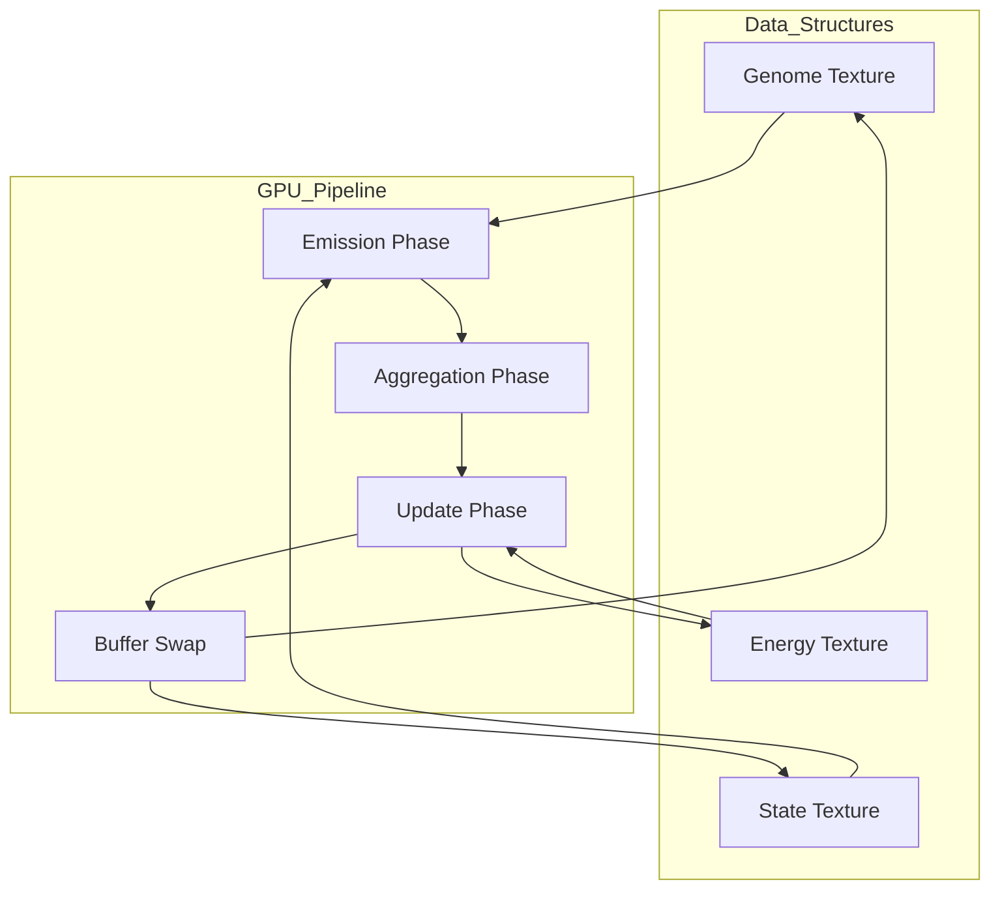

# Genetic Cellular Automaton

*A Conway's Game of Life implementation with evolutionary genetics and GPU-accelerated computation*

## Overview

This project reimagines Conway's Game of Life as a **genetic cellular automaton** where each cell carries encoded DNA that determines its behavior. Unlike traditional Conway's GoL with binary alive/dead states, this implementation features cells with genetic codes, internal states, and directional emission capabilities that create emergent evolutionary patterns.

The system bridges the gap between classical cellular automata and modern genetic algorithms, designed specifically for GPU shader optimization to enable large-scale ecosystem simulations with real-time performance.

## Architecture Principles

- **Deterministic Evolution**: Reproducible results through deterministic genetic rules
- **GPU-First Design**: Bit-packed data structures optimized for shader computation
- **Local Interactions**: All cellular decisions based on Moore neighborhood (8-cell)
- **Emergent Complexity**: Simple genetic rules producing complex ecosystem behaviors
- **Shader Compatibility**: Branchless logic for efficient fragment shader execution

## Technology Stack

- **Core Framework:** Python 3.8+ with NumPy (CPU prototype)
- **GPU Computing:** OpenGL/ModernGL with GLSL shaders
- **Visualization:** Pygame for real-time display and interaction
- **Data Structure:** Bit-packed RGBA textures for genetic encoding
- **Performance:** Fragment shaders with ping-pong buffer rendering

## Project Structure

```
Boris/
├── genetic_automaton.py            # Main application entry point
├── requirements.txt                # Python dependencies
├── models/                         # Data models and genetic structures
│   ├── cell_genome.py              # Genetic encoding/decoding
│   ├── emission_patterns.py        # Directional influence patterns
│   └── energy_systems.py           # Energy conservation models
├── simulation/                     # Core simulation engine
│   ├── cpu_simulator.py            # NumPy-based prototype
│   ├── gpu_simulator.py            # OpenGL shader implementation
│   └── grid_manager.py             # Grid state management
├── shaders/                        # GLSL shader programs
│   ├── emission_phase.frag         # Cellular emission computation
│   ├── aggregation_phase.frag      # Neighbor influence aggregation
│   └── update_phase.frag           # State transition logic
├── visualization/                  # Display and interaction
│   ├── renderer.py                 # Real-time visualization
│   ├── controls.py                 # User interaction handling
│   └── analytics.py                # Population analysis tools
├── tests/                          # Test suite
│   ├── test_genetics.py
│   ├── test_simulation.py
│   └── test_shaders.py
└── README.md                       # This file
```

## Core Components & Data Flow

1. **Genetic Engine** - Manages cellular DNA encoding, mutation, and inheritance
2. **Emission System** - Handles directional influence propagation between cells
3. **Energy Manager** - Maintains conservation laws and metabolic costs
4. **GPU Pipeline** - Executes simulation phases through shader programs
5. **Visualization Layer** - Renders real-time genetic diversity and population dynamics

**Simulation Flow:**



## Data Architecture

### Texture-Based Encoding

The simulation operates on GPU textures with bit-packed genetic information:

#### **Genome Texture** (RGBA)

- **R Channel**: North(4bit) + Northeast(4bit) emission values
- **G Channel**: East(4bit) + Southeast(4bit) emission values
- **B Channel**: South(4bit) + Southwest(4bit) emission values
- **A Channel**: West(4bit) + Northwest(4bit) emission values

#### **State Texture** (RGBA)

- **R Channel**: Reproduction threshold(4bit) + Current energy(4bit)
- **G Channel**: Death threshold(4bit) + Age(4bit)
- **B Channel**: Mutation rate(4bit) + Activity level(4bit)
- **A Channel**: Generation(4bit) + Reserved(4bit)

### Bit Packing Example

```glsl
// Decode emission values in shader
vec4 genomeData = texture2D(genomeTexture, uv);
float northEmission = floor(genomeData.r * 255.0 / 16.0);
float northeastEmission = mod(genomeData.r * 255.0, 16.0);

// Encode new state values
float newEnergy = clamp(currentEnergy + energyDelta, 0.0, 15.0);
float newAge = clamp(currentAge + 1.0, 0.0, 15.0);
gl_FragColor.g = (newAge * 16.0 + newEnergy) / 255.0;
```

## Simulation Algorithm

### Per-Frame GPU Pipeline

1. **Emission Phase** (`emission_phase.frag`)

   - Each cell calculates directional emissions based on genome and energy state
   - Emissions modulated by current activity level and age
   - Results stored in temporary emission buffer
2. **Aggregation Phase** (`aggregation_phase.frag`)

   - Cells sample emissions from 8 neighbors using Moore neighborhood
   - Calculate total environmental pressure and genetic compatibility
   - Determine survival probability and reproduction potential
3. **Update Phase** (`update_phase.frag`)

   - Apply genetic rules to determine cell fate:
     - **Survival**: Energy within stable range
     - **Death**: Energy depletion or overstimulation
     - **Reproduction**: Sufficient neighbor emissions + compatible genetics
     - **Mutation**: Probabilistic bit-flips in genetic code
   - Update cell state and energy levels
4. **Buffer Swap**

   - Ping-pong between front and back buffers
   - Maintain simulation continuity across frames

## Design Decisions

### Genetic Encoding Strategy

**4-bit directional emissions** rather than single values:

- Enables complex spatial behaviors (territoriality, cooperation, migration)
- Maps efficiently to GPU texture channels
- Allows for asymmetric emission patterns creating directed movement
- Provides sufficient genetic diversity without excessive complexity

### Energy Conservation Model

**Local energy conservation** with optional global constraints:

- Prevents runaway population growth
- Creates natural selection pressure for efficient genomes
- Enables boom-bust population cycles
- Supports stable ecosystem equilibria

### Deterministic Mutations

**Bit-flip mutations based on deterministic noise** rather than random:

- Maintains reproducibility across runs
- Enables debugging and analysis of specific genetic lineages
- Compatible with shader execution model
- Allows for controlled mutation pressure adjustment

### Conway's Game of Life Preservation


| Original Conway's Rule      | Genetic Equivalent                            |
| ----------------------------- | ----------------------------------------------- |
| 3 neighbors → birth        | Sufficient emission threshold → reproduction |
| <2 or >3 neighbors → death | Energy below/above viable range → death      |
| Static structures           | Self-stabilizing genetic configurations       |
| Gliders & oscillators       | Asymmetric emission patterns → movement      |

## Development Roadmap

### ✅ Phase 1: CPU Prototyping

- [ ] Basic genetic encoding/decoding system
- [ ] NumPy-based simulation engine
- [ ] Pygame visualization with genetic diversity display
- [ ] Parameter optimization and stability analysis
- [ ] Performance benchmarking against classical GoL

### 🔜 Phase 2: GPU Migration

- [ ] GLSL shader implementation of all simulation phases
- [ ] OpenGL texture management and ping-pong rendering
- [ ] Performance optimization for large grids (1024x1024+)
- [ ] Real-time genetic analysis and visualization

### 🧪 Phase 3: Advanced Features

- [ ] Interactive genetic editing tools
- [ ] Population diversity metrics and tracking
- [ ] Export/import of stable genetic configurations
- [ ] Comparative analysis with traditional cellular automata

### 🎯 Phase 4: Ecosystem Analysis

- [ ] Long-term evolution tracking
- [ ] Emergent behavior classification
- [ ] Genetic lineage analysis
- [ ] Ecosystem stability studies

## Expected Evolutionary Behaviors

- **🏔️ Territorial Species**: High-emission genomes creating spatial dominance zones
- **🤝 Symbiotic Colonies**: Complementary emission patterns enabling mutual survival
- **🌊 Migratory Waves**: Asymmetric emissions producing traveling population fronts
- **⚖️ Predator-Prey Dynamics**: Competing genetic strategies in dynamic equilibrium
- **🔄 Reproductive Cycles**: Periodic population booms and genetic bottlenecks
- **🧬 Genetic Drift**: Gradual evolution toward locally optimal configurations

## Performance Targets

### CPU Implementation

- **Grid Size**: 512x512 cells at 30+ FPS
- **Genetic Complexity**: 8-direction emissions + 4 state parameters
- **Population Density**: Up to 50% grid occupancy (or more if there is a grass-type species)

### GPU Implementation

- **Grid Size**: 2048x2048 cells at 60+ FPS
- **Shader Efficiency**: <1ms per simulation phase
- **Memory Usage**: <100MB for all textures and buffers

## Getting Started

### Prerequisites

- Python 3.8+
- NumPy, Pygame
- OpenGL 4.0+ (for GPU version)
- ModernGL (for shader management)

### Quick Start

```bash
# Clone and navigate to implementation
cd Conway-Game-of-Life/Boris

# Install dependencies  
pip install -r requirements.txt

# Run CPU prototype
python genetic_automaton.py

# Run GPU version (when available)
python genetic_automaton.py --gpu
```

### Configuration

```python
# genetic_config.py
GRID_SIZE = (512, 512)
MUTATION_RATE = 0.01
ENERGY_DECAY = 0.95
REPRODUCTION_COST = 5
EMISSION_COST = 1
```

## Future Integration

This genetic cellular automaton framework is designed for extensibility:

1. **Custom Genetic Operators**: Add new mutation types and selection pressures
2. **Environmental Factors**: Introduce external energy sources, obstacles, gradients
3. **Multi-Species Systems**: Support for multiple genetic families with different rules
4. **3D Extension**: Expand to volumetric grids with 26-neighbor interactions
5. **Real-Time Interaction**: User-controlled genetic editing and environmental manipulation

## Development Notes

**August 04, 2025 - Project Initialization**
Starting with the genetic cellular automaton concept as an advanced-level Conway's Game of Life implementation. The focus is on creating a deterministic system that can evolve complex behaviors while maintaining the aesthetic appeal of classical cellular automata.
Key design challenge: balancing genetic complexity with computational efficiency. The 4-bit emission encoding provides 16^8 possible genetic configurations per cell, which should be sufficient for interesting evolution while remaining shader-friendly.Future Considerations:

- Investigate genetic algorithm techniques for optimizing stable configurations
- Explore connections to artificial life and digital evolution research
- Consider integration with machine learning for pattern recognition and classification

*This section will document ongoing development insights, performance discoveries, and evolutionary behavior observations throughout the project lifecycle.*

---

*This implementation explores the intersection of cellular automata, genetic algorithms, and GPU computing to create rich, evolving digital ecosystems that maintain the elegance and appeal of Conway's original Game of Life.*